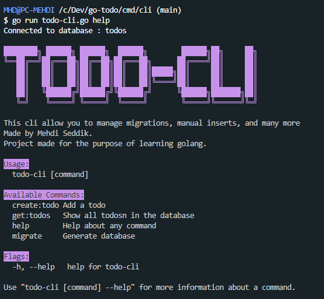

# Golang rest boilerplate

This boilerplate contain an API and a CLI tool. The API provides CRUD (Create, Read, Update, Delete) operations for a todo list, while the CLI tool allows you to manage migrations, list todos, and create new todos.

## API

The API component of the project is responsible for handling interactions with a todo list.

### Endpoints

Create Todo - `POST /api/v1/todos/new` |
Create a new todo item. You can provide the title and description of the todo in the request body.

Get Todo - `GET /api/v1/todos/{id}` |
Retrieve the details of a specific todo item based on its ID.

List Todos - `GET /api/v1/todos` |
Get a list of all todo items.

Update Todo - `PUT /api/v1/todos/{id}` |
Update the details of a todo item. You can provide the new title and description in the request body.

A postman collection is provided in `docs/postman_collection.json`

### Usage with docker

To run the docker stack, simply copy paste the .env.example file to .env, then use the following command:

```bash
docker compose up --build
```

### Usage for contributors

first copy paste the .env.example file to .env and change the values accordingly to your database configuration

To run the API, navigate to the `cmd/api` directory and execute the following command:

```bash
go run main.go
```

The API will be accessible at <http://localhost:8080>.

# CLI

The CLI component of the project provides a command-line interface for managing migrations and interacting with the todo list.

Available commands are listed in the help page:



### Usage

To use the CLI, navigate to the `cmd/cli` directory and execute the appropriate commands. For example:

```bash
go run main.go migrate
```

or

```bash
go run main.go get:todos
```
